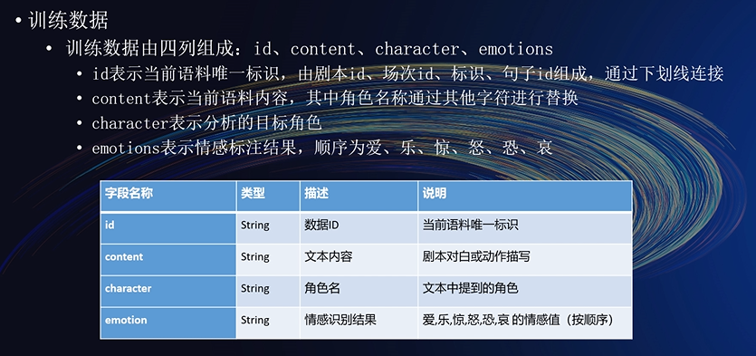

# CCF BDCI剧本角色情感识别

排名靠后！！仅仅为了记录自己第一次比赛（以下结果仅仅是自己试验的结果，**不一定正确**。毕竟自己能力有限）

**方法只有自己试过了才知道好不好**

## 赛题分析

[比赛官网](https://www.datafountain.cn/competitions/518)

官方视频讲解时给的思路，我觉得非常好！！！

## 总体思路

### 任务策略

* 分类
  * 采用6个标签
  * 将标签展开，采用24个标签的形式
* 回归

在实际线上提交中，回归的效果要好于分类，所以采用回归方法。

### 数据处理

24标签数

6标签数

采用回归方法做(线上得分高，故采用回归来做)

* 数据预处理

  * 原始数据处理：

    由于句子长度比较短，且一句话的情感往往与同一个角色的前几句话有关。所以将每一句小于70的话的前3句组合在一起。形成一个长句。

  * 去除标点符号：

    由于数据本身长度比较短，去除标点符号，效果不好。

  * 数据拼接：  

     **剧本id + 场次id + 标识 + ':' + 角色 + ':' + 文本内容**

  * 训练集验证集的切分：

    以剧本和场次进行切分。

  * 句子长度：

     将每句长度设置为110

* 后处理输出结果的策略
  * [-,0.5) : 0 ; [0.5,1.5) : 1 ; [1.5,2.5) : 2 ; [2.5,+] : 3  效果不理想
  * 小于0的全部置为0，大于3的全部置为3  可以提升0.0005
  * 将所得到的多个数据文件进行平均处理。也就是模型融合的第三种方式。

### 模型

* 采用BERT
* 采用roberta(效果比较好)
* 采用LACO(效果中规中矩)
  * 论文：Enhancing Label Correlation Feedback in Multi-Label Text Classification via Multi-Task Learning
  * 主要利用的方法：训练集[cls]text[sep]true label[sep]; 测试集:[cls]text[sep]
* 采用chineseBERT(效果不理想)
* 采用macbert(效果中规中矩)
* 采用roformer(效果比较好)
* 采用electra(效果不理想)
* 采用nezha(效果不理想)
* 采用Bi-GRU(效果不理想)
* 采用CNN(效果不理想)

### 模型融合

* 多模型融合（将多个模型的参数相加平均处理，但是要求模型相同）（第一种方式）
* 多模型融合（投票）(将每个位置的结果相加求平均)（第二种方式）
* 多模型融合（简单求平均）（第三种方式）

### 训练

* 余弦退火策略

* 早停策略

* 分层权重衰减

* 预热：

    * get_cosine_schedule_with_warmup（效果要好一点）

    * get_linear_schedule_with_warmup
    
* 梯度裁剪原理(torch.nn.utils.clip_grad_norm)一般梯度爆炸或者消失的时候采用

* 对抗学习(fgm)大概可以提升一点(FDG)效果不太好

* 数据增强(EDA)
  * 采用回译方法，然后处理每个标签中数据不平衡的问题(效果不太好)
  * 同义词替换(因时间问题并未实现)

* 知识蒸馏(自蒸馏：两个一样的模型，自己既作为老师也作为学生)  效果不太好

* 五折交叉验证(有效果，就是训练时间比较长)

* 标签平滑(效果不太理想)

### 损失函数

* 分类

  BCEWithLogitsLoss

* 回归

  MSELoss

### 结果分析

[结果分析](analyze.md)

## 思考

我觉的本次比赛数据处理方面给我的最终分数带来了比较大的提升。

可以改进的点：

* 未能对原始数据进行再训练  （效果应该还能提升）
* 仅仅使用了预训练模型，并未针对任务设计模型框架
* 